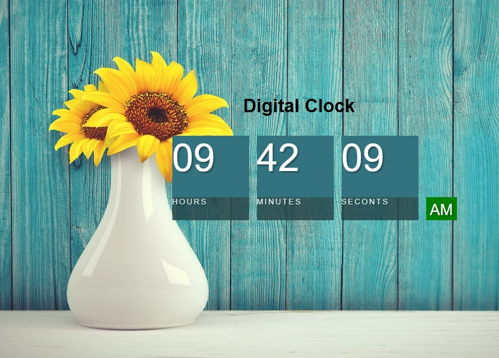

## 🕰️ Digital Clock  

A sleek and modern **Digital Clock** built using HTML, CSS, and JavaScript. Display the current time with a real-time updating clock that shows hours, minutes, and seconds in an easy-to-read format.  

## 🚀 Features  
- ✅ Real-time updating clock showing **hours, minutes, and seconds**  
- ✅ Simple and clean UI design  
- ✅ 24-hour format clock  

## 🛠 Tech Stack  
HTML, CSS, JavaScript  

## 📷 Screenshots  
  

## 📌 How It Works  
1. The clock automatically updates every second to show the current time.  
2. The time is displayed in **24-hour format**.  

 
